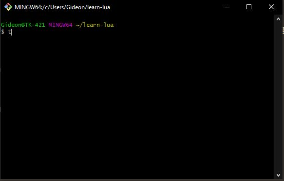

# Reading input from a file

Open Git Shell and open the projects folder



Create a new project folder, in vscode create a new folder on the left there will be a little folder with a plus and name the new folder `03-FirstProgram`

Create a file in this folder named `input.lua`.

In this lesson we are going to learn about reading input. This wont be useful for you later, but it is useful now while we learn.

We begin with crating a variable.

```lua
-- Define a variable "bucket" to hold the value we will read
local name = ""
```

> _NOTE:_ `-- ` denotes the start of a comment, nothing that follows it will be run.

The `local` keyword is how we let the code know the following bits are a variable we can use to store values. We can treat variables as buckets that hold water.

We now need get a value from the user, but first we want to ask a question:

```lua
-- Ask a question before we read the answer
print("Give me a name:")
```

Run the script:

```
lua.exe input.lua
```

You should see the following:

```
Give me a name:
```

From here we are going to read in a value from the command line.

```lua
-- Read in the answer, a line (*line) from the terminal
name = io.read("*line")
```

You will now be able to type in a name once you run the script again.

Now that we have the value, we need to do something with it.

```lua
-- Now we want to check *if* the name has been entered and say hello
if name ~= "" then
    print("Hello ", name)
end
```

We are going to take the value we read in and make sure it isn't empty. We use an `if` statement to compare things, and to _conditionally_ do different things. We will talk about `if` statements more in later lessons.

The `if` statement we added about checks to make sure that we entered a name, and then says hello.

If we run the program one last time you should see the following if you enter your name:

```
❯ lua.exe 03-reading-input/input.lua
Give me a name:
jesse
Hello   jesse
```

Find the full file here: https://github.com/gideonw/teach-jesse-lua/blob/gh-pages/03-reading-input/input.lua
